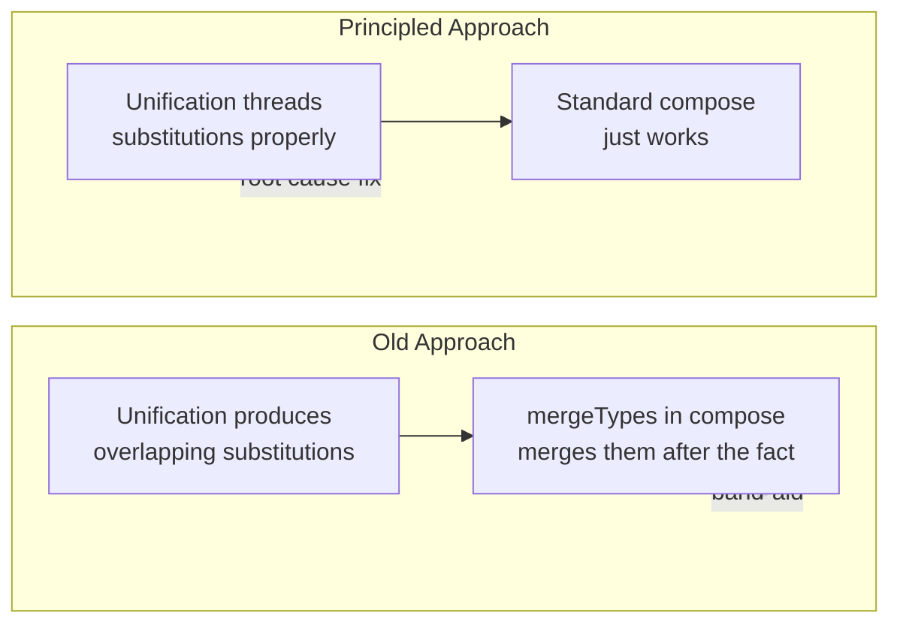

# Proper row-polymorphism: thread substitutions in unification

## Root Cause

The real problem is not in `compose` -- it is in record unification producing **overlapping substitutions** for the same type variable. The old `mergeTypes` in `compose` was a band-aid that masked this. The principled fix is to thread intermediate substitutions through the unification steps, so each step sees the results of previous steps.

### The bug in record unification (both-open case)

In [compiler/main/Infer/Unify.hs](compiler/main/Infer/Unify.hs) lines 43-58:

```haskell
s1 <- unifyVars' M.empty (M.elems fieldsToCheck) (M.elems fieldsToCheck')
s2 <- unify (TRecord fieldsForLeft (Just newBase) mempty) tBase'
s3 <- unify (TRecord fieldsForRight (Just newBase) mempty) tBase       -- BUG: s1,s2 not applied
return $ s1 `compose` s2 `compose` s3
```

When `tBase == tBase'` (same row variable on both sides), `s2` and `s3` both map the same variable. Standard `compose` drops one mapping. With proper threading, `s3` would see the already-resolved base and produce a substitution for `newBase` instead, avoiding overlap entirely.

### Same bug in `unifyElems'` (lines 142-147)

```haskell
unifyElems' t (t' : xs) = do
  s1 <- unify t' t
  s2 <- unifyElems' t xs        -- BUG: s1 not applied to t
  return $ compose s1 s2
```

### Missing defaulting in `postProcessBody`

Independently, the simplified `postProcessBody` removed per-expression defaulting (`tryDefaults`) and ambiguity resolution. This is needed for `Number a` to default to `Integer`, `Bits a` to default to `Integer`, etc. -- which is why `3 ^ 20` produces `{}` instead of `23`.

## Changes

### 1. Thread substitutions in record unification -- `Unify.hs`

**Case 1 (both open)** -- apply intermediate substitutions before each step:

```haskell
s1 <- unifyVars' M.empty (M.elems fieldsToCheck) (M.elems fieldsToCheck')
s2 <- unify (apply s1 $ TRecord fieldsForLeft (Just newBase) mempty) (apply s1 tBase')
let s12 = s2 `compose` s1
s3 <- unify (apply s12 $ TRecord fieldsForRight (Just newBase) mempty) (apply s12 tBase)
return $ s3 `compose` s12
```

**Cases 2 and 3 (one open, one closed)** -- pass `s1` into `unifyVars'` so common field unification sees base constraints:

```haskell
s1 <- unify tBase (TRecord fieldsDiff Nothing commonFields)
...
s2 <- unifyVars' s1 (M.elems fieldsToCheck) (M.elems fieldsToCheck')
return s2
```

(`unifyVars'` already threads its accumulator internally and returns the final composed substitution, so we just pass `s1` as the seed.)

### 2. Thread substitution in `unifyElems'` -- `Unify.hs`

```haskell
unifyElems' t (t' : xs) = do
  s1 <- unify t' t
  s2 <- unifyElems' (apply s1 t) xs
  return $ compose s2 s1
```

### 3. Restore original `postProcessBody` -- `Exp.hs`

Replace the simplified version (lines 243-254) with the original that includes:

- Per-expression ambiguity detection via `ambiguities`
- Defaulting via `tryDefaults` (twice, for chained defaults)
- Instance resolution checks via `byInst`
- Per-expression error reporting with accurate source locations

This requires adding `forM` / `forM_` imports.

### 4. Keep improvements from previous work

- Chain-following `apply` for `TVar` (no change)
- Standard THIH `compose` without `mergeTypes` (no change)
- Standard composition order at call sites (no self-composition hacks)
- `generalize` factoring, cleanup, deduplication, etc.

## Why this is better than restoring `mergeTypes`



With proper threading, each unification step sees the full state from previous steps. A row variable that was already constrained gets resolved before the next step, so no two steps ever produce mappings for the same variable. Standard THIH `compose` then works without any record-specific logic.